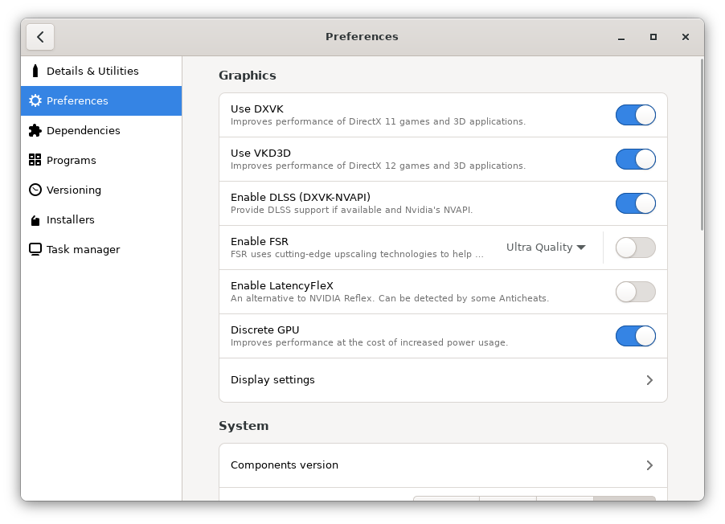
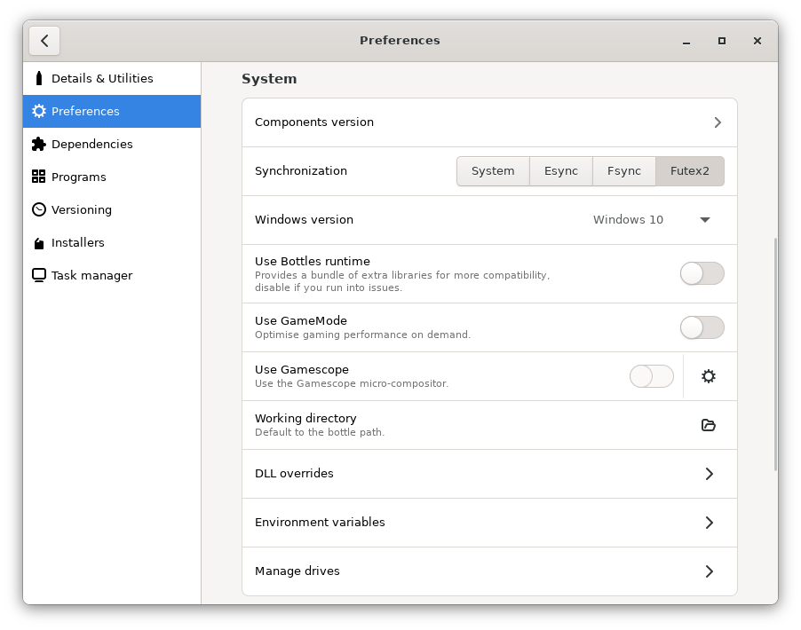
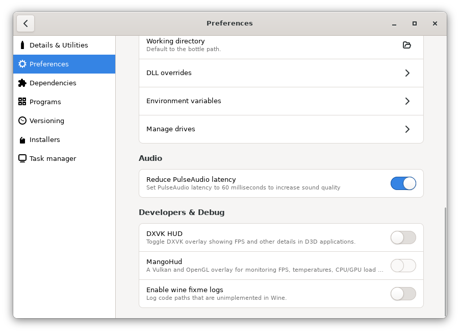

# Bottle preferences

This is one of the most important sections, here you can configure and tweak your bottle.

This page is divided into four sections:

* Graphics
* System
* Audio
* Developers & Debug

In the **Graphics** section you can set up some graphics related utilities, e.g. you can toggle [DXVK, VKD3D](../components/dxvk.md), DLSS, FSR, LatencyFleX or choose to use a virtual desktop with a custom resolution or make Bottles use your discrete GPU (for dual-gpu laptops, like optimus, this will improve performances at the cost of increased power usage).

From the **System** section you can:
* change the components (runner, dxvk...) versions
* choose the synchronization type
* change the Windows version
* change the working directory (the path where the executable will be executed)
* register new DLL Overrides and environment variables
* manage drives for accessing files inside bottle
* and more...

In the **Audio** section you can toggle the "Reduce PulseAudio latency" feature which improves the audio quality for some games.

The **Developer & Debug** section offers some utilities for developers. Here you can show the wine fixme logs and enable the DXVK HUD or MangoHud to display the FPS counter, draw calls, dxvk versions and other information.

## Runtime 

Runtime is a `lib bundle` which maintains the compatibility for installers, it is available by default on **Flatpak packages** instead for other package types (e.g AUR, Fedora, …) you will need to install it from the program preferences.
