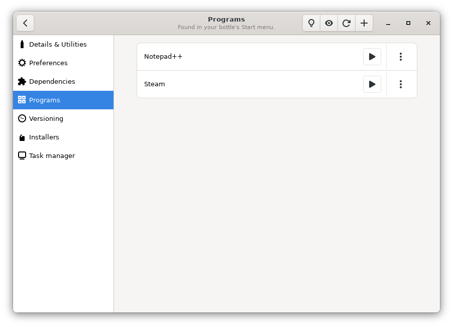
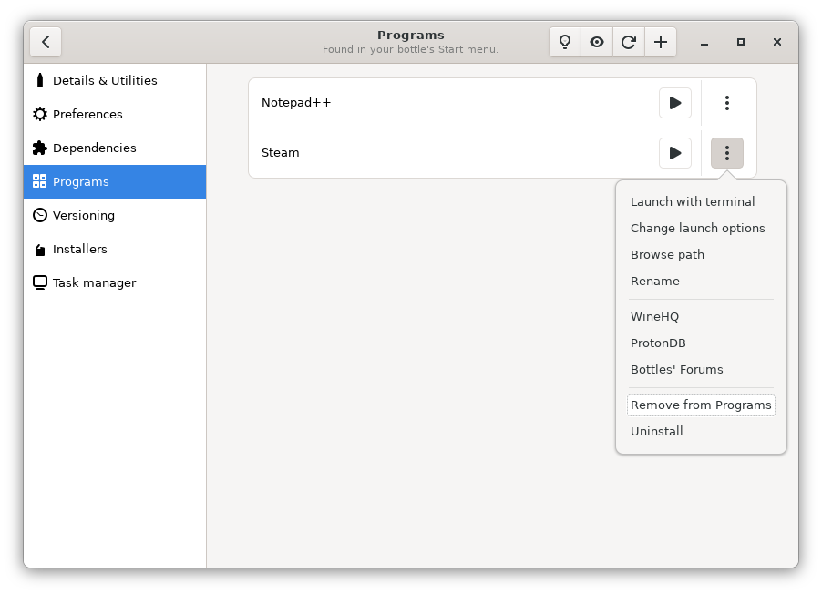
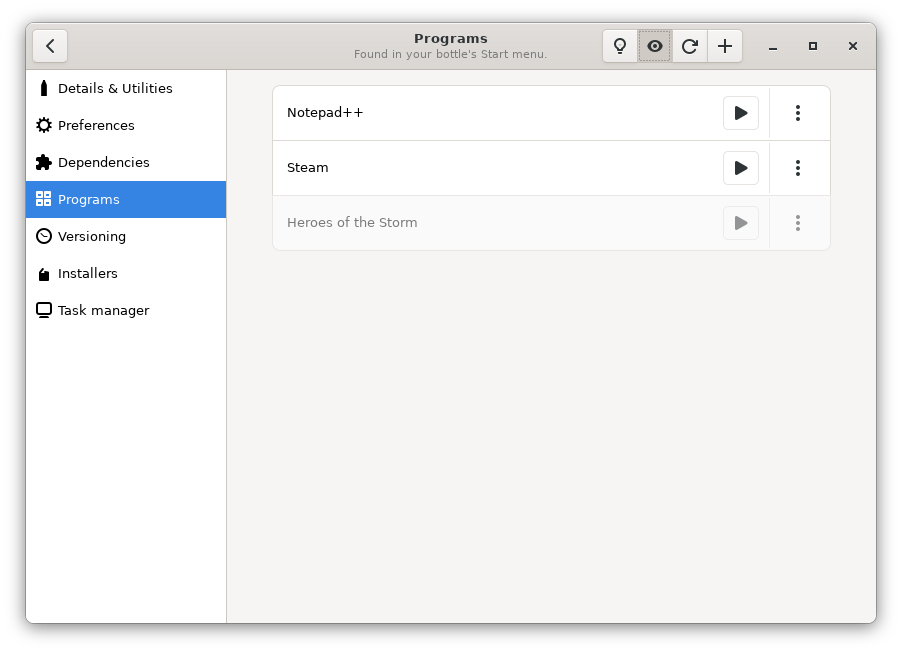
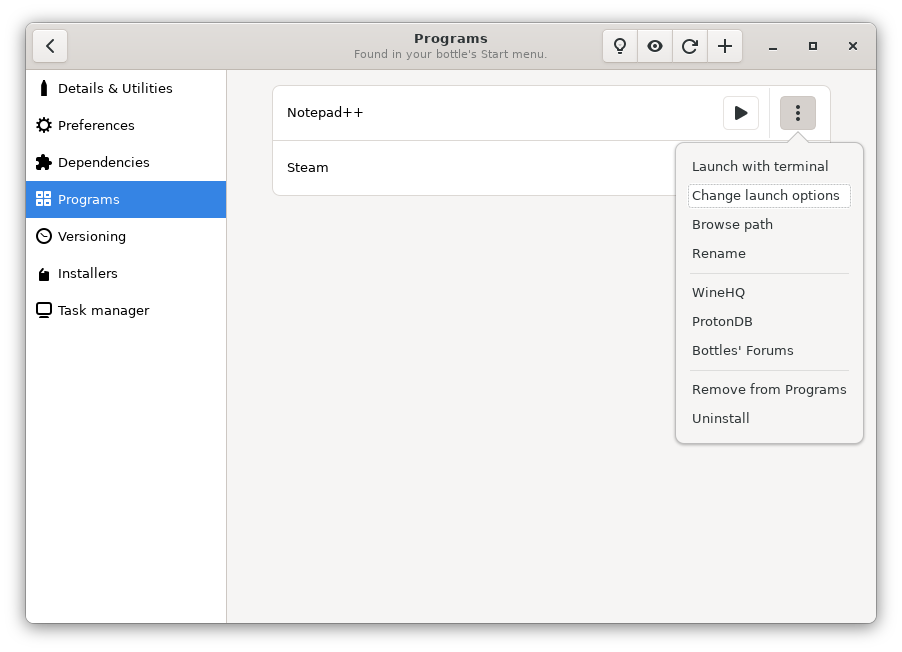
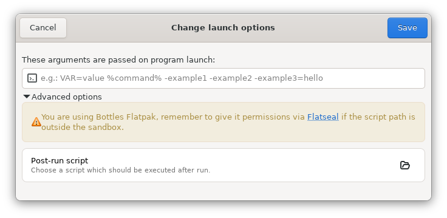

# Programs

Bottles searches the bottle for the installed software and places them in the programs section of the bottle.

The search is done through the common Start Menu directories, Bottles looks for all the `.lnk` files in these directories and extracts some information such as: name of the application and path of the executable.

### Launch installed programs

After installing a software application in the bottle, just go to the Programs section to start it.



If you don't see the program you are looking for, press the Refresh button at the top right () to let Bottles searching for new programs.

Then press the Play button on the right () to start the program.

### Add сustom programs

If Bottles cannot find your program automatically, you can manually specify the path to the executable file. To do this, click on the Add button () and select the executable file.

### Hide programs

You can hide those programs that you don't want to see in the installed list. To do this, open the context menu of the program (the icon with the 3 dots) and select the "Remove from Programs" option.



You can switch the display mode of hidden programs using a special button . After switching the display mode, you will be able to see previously hidden programs.



### Custom arguments

Some programs may require arguments to be passed to the executable. To set them you can open the context menu and choose "Change launch options".



A field will appear where you can enter the arguments of the executable, once done press Save at the top right and start the program. Bottles will remember the arguments for that executable, so you don't have to add them again.


In the "Advanced options" section, you can specify the script that will be run immediately after your application is launched.



#### Prefix and suffix in launch options

The `%command%` placeholder can be used in the Launch Options to customize prefixes and suffixes:

```bash
my_command %command% -flag1 -flag2
```

### Add programs to your Desktop

To add a program in your Desktop Applications menu, choose "Add Desktop Entry" in the program's menu.

#### Flatpak

The Flatpak version need a special permission to generate desktop entries. To achieve this, close Bottles and open your terminal, then type:

```
flatpak override com.usebottles.bottles --filesystem=xdg-data/applications
```

then start Bottles again.

We also made a video tutorial using Flatseal:


Add desktop entries using Bottles Flatpak


### Add programs in Steam

Since Bottles 2022.5.28, it is possible to add programs in your Steam client, useful for Steam Deck users who want to launch their games without having to launch the Bottles GUI.

To achieve this just choose "Add to Steam" in the program's menu.

#### Flatpak

Bottles Flatpak need special permissions to add shortcuts to Steam. Close Bottles and open your terminal, then type:

```
flatpak override com.usebottles.bottles --filesystem=~/.local/share/Steam
flatpak override com.usebottles.bottles --filesystem=~/.var/app/com.valvesoftware.Steam/data/Steam
```

then start Bottles again.

### The program does not appear

If the program does not appear in the list even after the Refresh, it may be that it is installed in a path not monitored by Bottles. [Open an issue](https://github.com/bottlesdevs/Bottles/issues/new/choose) so that we can identify the path and add it to the list of directories.
